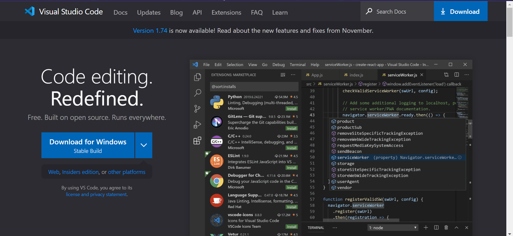
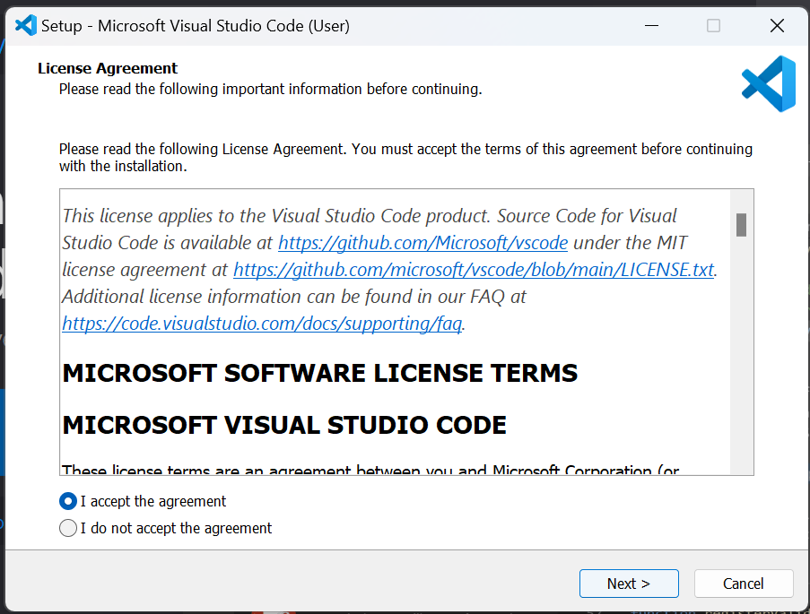
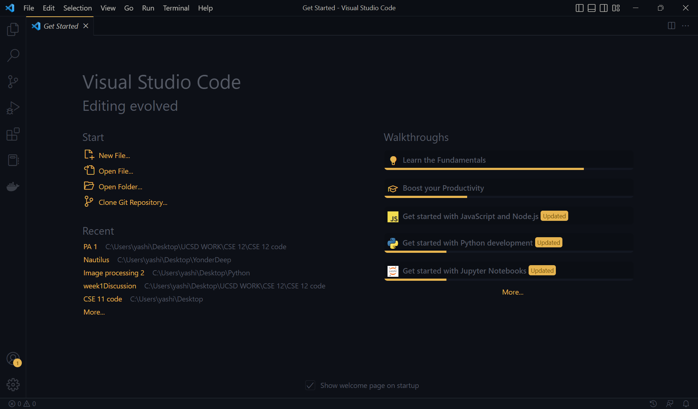
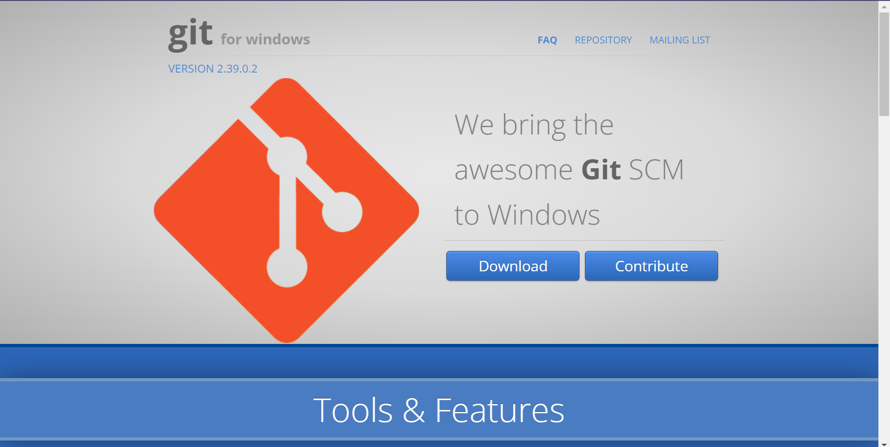
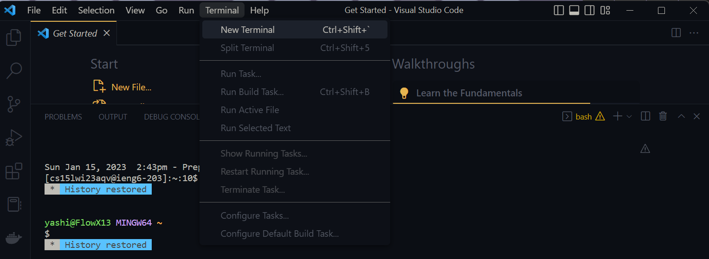
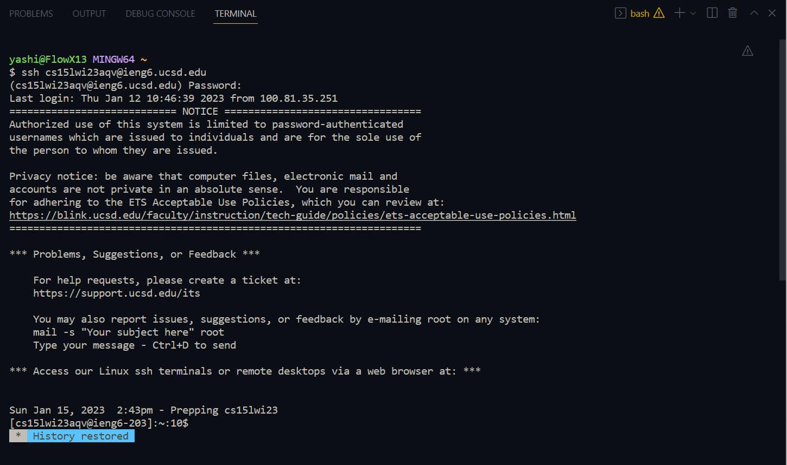
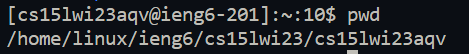
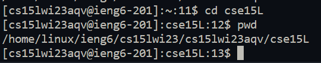
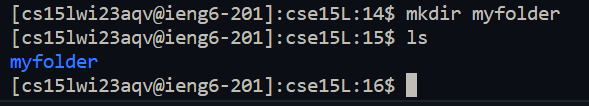
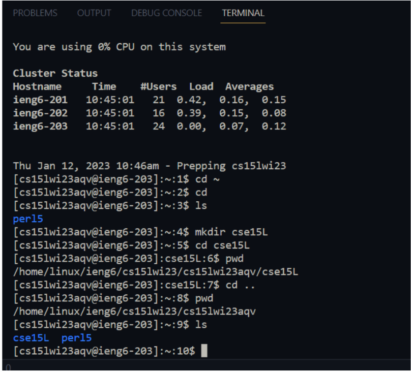

# Tutorial for CSE15L setup

This tutorial will get you started with this class and guide you with how to setup your 15L account. The three main components of this tutorial are: 

- Installing VS Code
- Remotely Connecting
- Trying Some Commands

Once you are done with this, you will be setup to continue with the rest of the work within this class!

## Installing VS Code

VS Code is a text editor where you can write and runn your programs. To install this, go to [Visual Studio website] (https://code.visualstudio.com) and download the program. There are different options for Mac and Window users, so choose accordingly. 



Once you have clicked on **_download_**, the setup file will get downloaded to your laptop. Click on this to complete the rest of the steps. A window will pop up asking you to agree with the terms and conidtions along with a few other questions. Click next at each of the steps and continue with the default options.



Once you finish this process, VS Code will be installed on your laptop. It should look like this.



Congratulations! You have successfully installed and setup VS Code. You can now type and run your code on this program.

## Connecting Remotely

This section will essentially teach you how to connect to a **remote** computer over the Internet to do work in this class. If you are a Mac user, ignore the step below.

**For Windows users:** 
Install Git for Windows through this [link] (https://gitforwindows.org/). Click on **Download** and complete the steps of setup.



Once you are done with this, you will use the newly installed **git bash** in your default terminal. To do this go to this [stackoverflow link](https://tinyurl.com/2kmfhnsb) and follow the steps given.

The following steps must be completed by all students.

1.  To ssh, open a terminal in VS Code (ctrl + ``````` OR cmd + ```````). You can also open a terminal by clicking on the button shown in the screenshot below. 



2.  Type in the command: ```$ ssh _username_@ieng6.ucsd.edu```. Your replace _username_ with your 15L username. Note: You do not actually type in ```$``` in the terminal. It's just a convention of how commands are written.
3.  Since this is the first time you are logging in, you wil be prompted with a question with the options of replying _yes/no_. Type in _yes_ in the terminal and press _Enter_. I often make this mistake of forgetting that the terminal is case-sensitive. So make sure to write _yes_ and not _Yes_ or _YES_ or any other possible versions. 
4.  Once this is done, you will be prompted to type in your password. Type in the password for your 15L account and click on _Enter_. 



One thing I noticed was that when you type the password in the terminal, the characters or black dots can't be seen. Don't worry about this. Your password is being typed, but it just doesn't show.

And that's it! You have successfully connectede to a computer in the CSE basement remotely. Please ask the TA/tutors/your peers questions if you are struggling with any of these steps since it is imperative that you complete them correctly in order to do all the work for this class. Don't shy from asking questions since that is how you learn!

## Trying some commands

Now that you have remotely connected to a computer from your VS Code terminal, explore the different commands you can execute and get a hang of how they work. You may not be used to this way of navigating directories and making changes to them, but it is important you get familiar with the environment since we will be using it a lot during this class. 

Here are some commands that I tried:


_Printing out my working directory_


_Changinig my directory_


_Making a new directory_ 

Here are some commands that I put together:



**Description**: I created a directory  “cse15L” and went into that directory. I then used ```pwd``` to print my working directory, went back to the original directory and used ```ls``` to list out the directories over there. This showed me the directory I created that was “cse15L”

Commands such as ```cd```, ```ls```, ```mkdir```, and ```pwd``` among others are extremely common. You should remember what each of them do since you will be using them very often. I often make use of websites such as [this](https://maker.pro/linux/tutorial/basic-linux-commands-for-beginners) or [this](https://www.digitalocean.com/community/tutorials/linux-commands) where a list of commands for beginners are listed. This helps me get started off with using the workspace. A simple Google search such as _"linux commands cheat sheet"_ will give you a lot of useful websites! Explore the different commands and play around with them.

## Conclusion

Now that you have familiarized yourself with these commands, you should be able to work in this environment. Remember the important notes that I have added in this tutorial so you don't make the same mistakes I did. Have fun programming and trying out new things!
